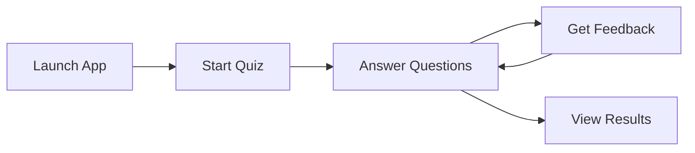
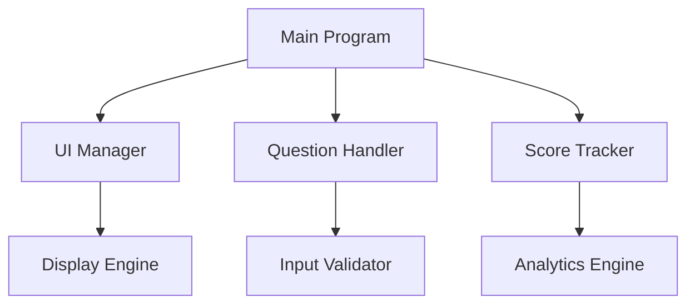

# 🎮 Modern Quiz Application

<div align="center">

[](LICENSE)
[](https://github.com/yourusername/modern-quiz)
[](https://en.wikipedia.org/wiki/C_(programming_language))

*A stunning, interactive command-line quiz application featuring modern UI design and cross-platform compatibility* 🚀

[Features](#-features) • [Installation](#-installation) • [Usage](#-usage) • [Customize](#-customization) • [Contribute](#-contributing)


</div>

## ✨ Features

<div align="center">

| Feature | Description |
|---------|-------------|
| 🎨 Modern UI | Beautiful console-based interface with custom borders and vibrant colors |
| 📊 Progress Tracking | Real-time progress visualization with dynamic progress bar |
| ✅ Smart Feedback | Instant response validation with color-coded feedback |
| 📱 Cross-Platform | Seamless experience across Windows, macOS, and Linux |
| 🎯 Performance Analytics | Detailed scoring with personalized performance insights |
| 🔄 Easy Configuration | Simple question customization and theme modifications |

</div>

## 🚀 Installation

### Prerequisites

- GCC Compiler
- Git (optional)
- Terminal knowledge (basic)

### Quick Start

```bash
# Clone the repository
git clone https://github.com/SafwanGanz/c-lang-quiz.git

# Navigate to project directory
cd c-lang-quiz

# Compile the application
gcc quiz.c -o quiz

# Launch the quiz
./quiz     # Unix-like systems
quiz.exe   # Windows
```

## 🎮 Usage

<div align="center">



</div>

1. **Launch** the application
2. Press **Enter** to begin
3. For each question:
   - 📖 Read carefully
   - 🎯 Select answer (A/B/C/D)
   - ✨ Receive instant feedback
   - ➡️ Continue with Enter
4. 📊 Review your performance

## 🎨 Customization

### Adding Questions

Modify the `questions` array in `quiz.c`:

```c
Question questions[] = {
    {
        "Your creative question here?",
        {
            "First option",
            "Second option", 
            "Third option",
            "Fourth option"
        },
        correct_answer_index  // 0-3 for A-D
    },
    // Add more questions...
};
```

### Theme Customization

Available color schemes:

| Code | Color | Usage |
|------|--------|-------|
| 2 | 🟢 Green | Success messages |
| 3 | 🔵 Cyan | Headers & UI elements |
| 6 | 🟡 Yellow | Questions & highlights |
| 7 | ⚪ White | Normal text |
| 10 | 🟢 Bright Green | Progress indicators |
| 11 | 🔵 Bright Cyan | Interactive elements |
| 12 | 🔴 Bright Red | Error messages |
| 14 | 🟡 Bright Yellow | Warnings & notices |

## 🛠️ Technical Details

### UI Components

- **Bordered Containers**: Custom-drawn boxes for content organization
- **Dynamic Elements**: Progress bars and interactive components
- **Color Psychology**: Strategic use of colors for better UX
- **Consistent Layout**: Carefully planned spacing and alignment
- **Cross-Platform Design**: Adaptive UI elements

### Architecture



## 🤝 Contributing

We welcome contributions! Here's how you can help:

1. 🍴 Fork the repository
2. 🌿 Create your feature branch:
   ```bash
   git checkout -b feature/AmazingFeature
   ```
3. 💫 Commit your changes:
   ```bash
   git commit -m 'Add: Amazing Feature'
   ```
4. 🚀 Push to the branch:
   ```bash
   git push origin feature/AmazingFeature
   ```
5. 🎉 Open a Pull Request

## 📝 License

This project is licensed under the MIT License. See the [LICENSE](LICENSE) file for details.

## 🙏 Acknowledgments

- Inspired by modern CLI applications
- Built with love for the programming community
- Special thanks to all contributors

---

<div align="center">

Made with ❤️ by [Your Name](https://github.com/yourusername)

</div>
